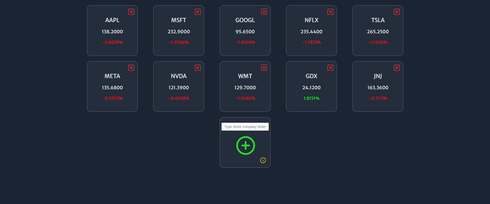

# Stock-Data-Dashboard

This project is a customizable stock market dashboard.

## Table of contents

- [Overview](#overview)
  - [Features](#Features)
  - [Screenshot](#screenshot)
  - [Links](#links)
- [Author](#author)
- [My process](#my-process)
  - [Built with](#built-with)
  - [What I learned](#what-i-learned)

## Overview

### Features

Users should be able to:

- View the optimal layout for the app depending on their device's screen size
- See information modal after clicking on info icon
- Add and remove stock company panel
- Keep dashboard state by saving data in `localStorage`

### Screenshot

### Links

- Solution URL: [Solution](https://github.com/wojciech94/Stock-Data-Dashboard/)
- Live Site URL: [Live Site Url](https://wojciech94.github.io/Stock-Data-Dashboard/)

## Author

- Website - [Wojciech94](https://github.com/wojciech94)

## My process

### Built with

- Semantic HTML5 markup
- Flexbox
- Mobile-first workflow
- Vanilla Javascript
- Local Storage

### What I learned

- Data fetching from API
- How to toggle modal area
- How to save data to local storage
